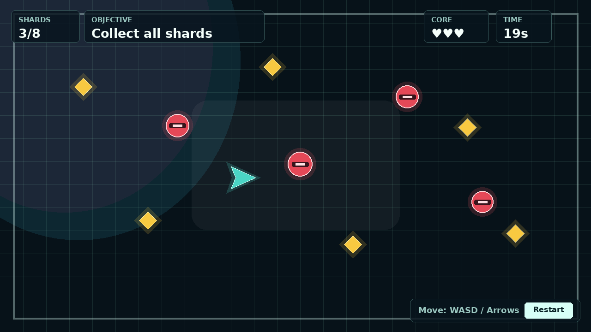

# Game Studio for Cocos

[English](README.md)

Game Studio for Cocos 是一个 Codex 插件，沿用 OpenAI 官方 Game Studio 插件的产品形态，并将底层游戏开发指导替换为面向 Web 和 native 游戏的 Cocos Creator 3.x + TypeScript。

这个插件设计为可以和官方 `game-studio` 插件同时安装：

- 插件名：`game-studio-for-cocos`
- 显示名：`Game Studio for Cocos`
- 插件路径：`plugins/game-studio-for-cocos`
- 默认技术栈：Cocos Creator 3.x + TypeScript
- 目标平台：通过 Cocos Creator 构建 Web、Android、iOS、macOS 和 Windows desktop

## 来源与致谢

本插件基于 OpenAI plugins 仓库中的官方 OpenAI Game Studio 插件改造而来。感谢 OpenAI 以及 Game Studio 的贡献者提供原始插件结构、skill 组织方式、sprite pipeline 工具和游戏工作流基础。本仓库在保持产品形态的基础上，将工作流改造成严格的 Cocos Creator 3.x + TypeScript 方案。

## 能力范围

- Cocos Creator 2D 游戏架构指导。
- Cocos Creator 3D 游戏架构指导。
- 场景、预制体、组件、资源包、物理、UI、Web 构建和 native 构建工作流。
- Android、iOS、macOS 和 Windows desktop 目标平台指导。
- 面向 Cocos 的 Web QA 和 native 真机/设备 QA 检查清单。
- 保留官方 Game Studio 中的 2D sprite pipeline 脚本。

## 严格 Cocos 运行时策略

本插件对可玩的游戏、demo、prototype 实现强制限定为 Cocos：

- 使用 Cocos Creator 3.x + TypeScript。
- 目标必须是真实 Creator 项目结构，包含 `project.json`、`assets/scenes`、`assets/scripts`、`assets/prefabs`，以及 `resources` 或明确记录的 asset bundle 布局。
- gameplay 渲染、输入、HUD、菜单、动画、物理、场景和预制体必须走 Cocos。
- 不得用原生 HTML canvas、纯 DOM 游戏、Phaser、PixiJS、Three.js、React Three Fiber、Babylon.js、自定义 WebGL、Cocos2d-x、Unity、Unreal、自定义 native engine，或只是“Cocos 风格”的模拟来替代。
- 如果本机无法运行 Cocos Creator 或缺少目标平台 SDK，则只能搭建兼容 Cocos 的项目结构并说明 editor/build 验证被阻塞，不能切换到其它引擎替代。

## 仓库 Metadata

建议的 GitHub 仓库描述：

```text
Codex Game Studio plugin for Cocos Creator 3.x and TypeScript Web and native games.
```

建议的 topics：

```text
codex-plugin, cocos-creator, cocos2d, cocos3d, typescript, browser-games, native-games, android, ios, desktop-games, game-development
```

## 安装

将本仓库添加为 Codex 插件 marketplace：

```bash
codex plugin marketplace add https://github.com/vibecoddd/game-studio-for-cocos --sparse .agents/plugins
```

然后在 Codex 的插件设置中，从新增的 marketplace 安装 `Game Studio for Cocos`。

如果是本地开发，可以从本地 checkout 添加：

```bash
codex plugin marketplace add /path/to/game-studio-for-cocos --sparse .agents/plugins
```

## 在 Codex 中使用

安装插件后，启动新的 Codex 会话，让插件技能完成加载。可以用自然语言触发，例如：

```text
Use Game Studio for Cocos to plan a Cocos Creator 3.x Web or native game.
```

```text
Build a Cocos Creator 2D action prototype with TypeScript, prefabs, and a HUD.
```

```text
Review this Cocos Creator 3D scene architecture and asset pipeline.
```

```text
Plan native Android and iOS targets for this Cocos Creator game, including SDK setup, signing, permissions, and device QA.
```

### 目标平台与构建产物选择指南

进入实现前，如果目标平台和构建产物还不清楚，插件会先提示用户选择：

```text
Platform checkpoint: choose target platform(s) and build output: Web build, Android APK/AAB, iOS app/IPA, macOS app, Windows app, or Web + native.
```

为了避免误判，prompt 里建议明确写出平台词：

| 目标平台 | Prompt 中建议写法 | 构建产物 | 必要验证 |
| --- | --- | --- | --- |
| Web | `Web`、`browser`、`site embed`、`PWA`、`Web build` | Cocos Creator Web build | Cocos Preview 或生成后的 Web build 浏览器验证 |
| Android | `Android`、`APK`、`AAB`、`Google Play`、`native mobile` | Android APK 或 AAB | Android emulator，加发布前真机 QA |
| iOS | `iOS`、`iPhone`、`iPad`、`IPA`、`App Store` | iOS app project 或 IPA | iOS simulator，加发布前真机 QA |
| macOS | `macOS`、`Mac desktop`、`desktop native` | macOS app bundle | 本机运行验证，需要时检查签名和 package |
| Windows | `Windows`、`PC desktop`、`desktop native` | Windows app/executable package | Windows package 运行验证、输入、存储和 high-DPI 检查 |
| Web + native | `Web + native`、`cross-platform`、明确列出目标平台 | 一个共享 Cocos 项目，加各平台产物 | Web build 检查，加每个 native 目标的 SDK/device 检查 |

如果 prompt 只写 `mobile`、`desktop` 或 `cross-platform`，插件应停在 checkpoint，先询问明确目标平台，再决定构建设置、输入假设、存储、权限和 QA 范围。

## Skills

- `game-studio-for-cocos`：主入口和路由 skill，用于早期 Cocos 游戏规划、Web/native 目标选择、2D/3D 方向判断，以及分发到专项 skill。
- `cocos-game-foundations`：建立核心架构、simulation 边界、输入模型、资源布局、存档/调试策略和平台目标假设。
- `cocos-creator-game`：指导真实 Cocos Creator 3.x 项目结构、场景、预制体、组件、resources、bundles、编辑器工作流和构建布局。
- `cocos-2d-game`：实现 2D Cocos 游戏，覆盖 sprites、tilemaps、UITransform 布局、animation clips、camera、2D physics 和 Cocos UI。
- `cocos-3d-game`：实现 3D Cocos 游戏，覆盖 cameras、lights、models、materials、animation、physics、Cocos UI 和 Web/native 运行约束。
- `cocos-native-game`：通过 Cocos Creator native build 工作流规划和构建 Android、iOS、macOS、Windows desktop 目标。
- `cocos-game-ui-frontend`：设计 Cocos UI，包括 HUD、menus、prompts、mobile controls、native safe areas，以及可选的外部 Web shell。
- `cocos-3d-asset-pipeline`：为 Cocos Creator 导入、prefabs、collision proxies、texture budgets、Web validation 和 native validation 准备及优化 3D assets。
- `cocos-sprite-pipeline`：生成、标准化并预览 2D sprite strips，保证 anchors、scale 和 animation review assets 一致。
- `cocos-game-playtest`：执行 Cocos runtime QA，覆盖 Preview、Web builds、native builds、截图、HUD 可读性、输入、性能和平台检查。

## 游戏 Demo

### 运行 Demo

前置条件：

- 使用 Windows 或 macOS 桌面环境，并通过 Cocos Dashboard 安装 Cocos Creator 3.x。
- 将本仓库 clone 到本地。
- 从 Dashboard 启动 Cocos Creator，然后选择本仓库的 `demo/` 目录作为已有项目打开。

在 Cocos Creator 中打开这个目录：

```text
demo/
```

首次场景设置：

1. 创建或打开 `assets/scenes/Game.scene`。
2. 创建一个 `Canvas` 节点作为游戏视图。
3. 添加名为 `WorldGraphics` 的子节点，并挂载 Cocos `Graphics` 组件。
4. 添加 HUD 节点，包含四个 Cocos `Label` 组件，分别用于 score、health、time 和 status。
5. 添加一个 Cocos `Button` 作为 restart 按钮。
6. 将 `assets/scripts/components/GameRoot.ts` 中的 `GameRoot` 组件挂载到 Canvas 或场景根节点。
7. 将 `assets/scripts/ui/HudController.ts` 中的 `HudController` 组件挂载到 HUD 节点。
8. 按下面文件说明在 Inspector 中绑定属性：

```text
demo/assets/scenes/README.md
```

在编辑器中运行：

1. 点击 Cocos Creator 的 Preview。
2. 确认游戏可以用 `WASD` 或方向键移动。
3. 点击 restart 按钮重新生成一局。

构建 Web 版本：

1. 打开 Project > Build。
2. 选择 Web 目标平台。
3. 从 Cocos Creator 构建并运行生成的 Web 输出。

构建 native 版本：

1. 打开 Project > Build。
2. 选择 Android、iOS、macOS 或 Windows 目标平台。
3. 在 Cocos Creator 中配置对应 SDK、签名、package 或 bundle id、屏幕方向和权限。
4. 从 Cocos Creator 构建，然后在该目标支持的 emulator、simulator 或真机上运行。

本地非编辑器检查：

```bash
cd demo
npm test
```

这些测试只验证 Cocos 项目结构和 deterministic simulation 逻辑，不能替代 Cocos Creator Preview、Web build 或 native build 验证。

操作方式：

- 移动：`WASD` 或方向键
- 目标：收集所有水晶碎片，并避开巡逻无人机
- 重新开始：点击界面里的 `Restart` 按钮

## 目录结构

```text
demo/
  project.json
  assets/
    scenes/
    scripts/
    prefabs/
    resources/
  settings/
  screenshots/
plugins/game-studio-for-cocos/
  .codex-plugin/plugin.json
  assets/
  references/
  scripts/
  skills/
```

## License

本项目使用 MIT License 授权。详见 [LICENSE](LICENSE)。
